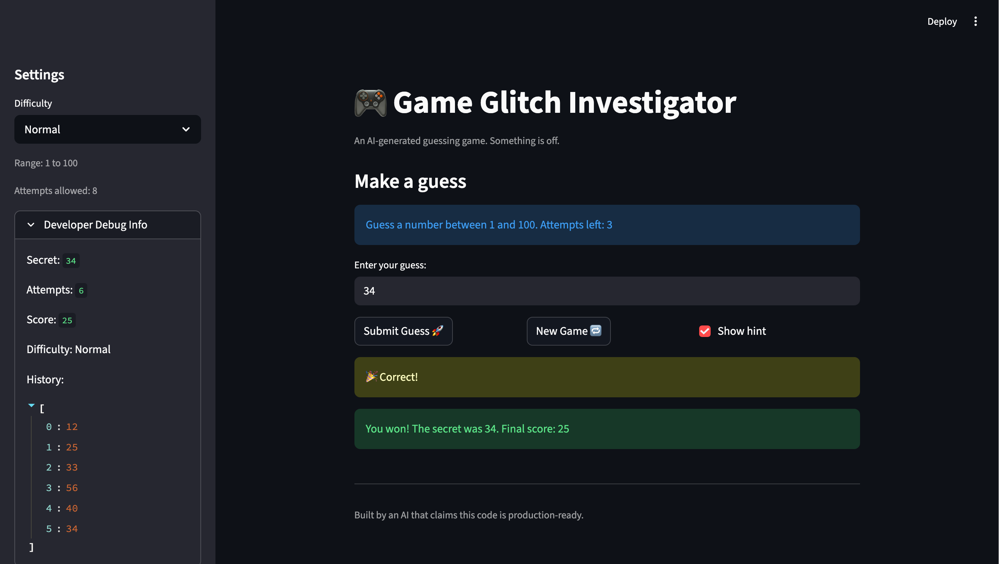
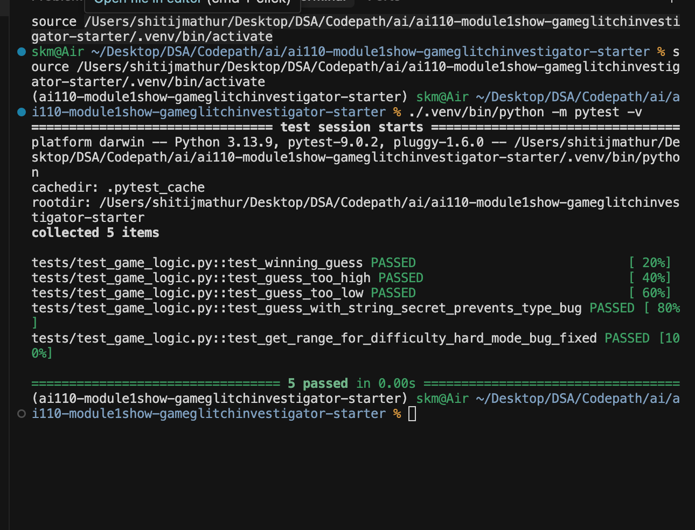

# 🎮 Game Glitch Investigator: The Impossible Guesser

## 🚨 The Situation

You asked an AI to build a simple "Number Guessing Game" using Streamlit.
It wrote the code, ran away, and now the game is unplayable. 

- You can't win.
- The hints lie to you.
- The secret number seems to have commitment issues.

## 🛠️ Setup

1. Install dependencies: `pip install -r requirements.txt`
2. Run the broken app: `python -m streamlit run app.py`

## 🕵️‍♂️ Your Mission

1. **Play the game.** Open the "Developer Debug Info" tab in the app to see the secret number. Try to win.
2. **Find the State Bug.** Why does the secret number change every time you click "Submit"? Ask ChatGPT: *"How do I keep a variable from resetting in Streamlit when I click a button?"*
3. **Fix the Logic.** The hints ("Higher/Lower") are wrong. Fix them.
4. **Refactor & Test.** - Move the logic into `logic_utils.py`.
   - Run `pytest` in your terminal.
   - Keep fixing until all tests pass!

## 📝 Document Your Experience

This game is a Streamlit-based number guessing app where the player tries to find a secret number within a limited number of attempts using "higher" and "lower" hints. When I first opened it, the game was effectively unwinnable because the hints were reversed, the secret number sometimes changed type mid-game, and the UI messages didn't always match the actual difficulty ranges. I fixed these issues by refactoring the core logic into `logic_utils.py`, stabilizing the secret and attempt counters in `st.session_state`, correcting the hint logic, and making the difficulty ranges and on-screen messages consistent. I also added and ran pytest cases (including an extra test for the hard-mode range) to make sure the repaired logic behaved correctly and stayed robust against the original edge cases.

## 📸 Demo

- Fixed game in action, showing a winning round with correct hints and score:

  

- Pytest results for the advanced edge-case tests (including the hard-mode range test) showing all tests passing:

  

## 🚀 Stretch Features — Challenge 2: Feature Expansion via Agent Mode

Two new features were planned and implemented using Agent Mode:

### 🏆 High Score Tracker
- Scores are persisted to a local `high_scores.json` file, keyed by difficulty level (Easy / Normal / Hard).
- When a player wins, the app checks whether their score beats the current record for that difficulty and saves it if so.
- The sidebar displays all high scores with `st.metric` widgets so you always know the score to beat.
- Helper functions `load_high_scores()` and `save_high_score()` were added to `logic_utils.py` and covered by new pytest cases.

### 📊 Guess History Sidebar
- After each guess, a table and bar chart appear in the sidebar showing every guess's value and its distance from the secret number.
- The bar chart visualizes convergence — if you're following the hints, the bars should trend toward zero.

### How the Agent Contributed
The AI coding agent (Agent Mode) was used to:
1. **Plan the feature design** — it suggested persisting scores to JSON keyed by difficulty and rendering a distance-based bar chart for guess history.
2. **Scaffold the implementation** — it generated the `load_high_scores` / `save_high_score` helpers, wired them into `app.py`, and built the sidebar UI for both features.
3. **Write tests** — it added three new pytest cases (`test_load_high_scores_missing_file`, `test_save_and_load_high_score`, `test_high_scores_separate_by_difficulty`) using temp files to avoid side effects.
4. **Iterate on details** — it handled edge cases like missing JSON files, corrupt data, and non-numeric guesses in the history list.

- [ ] [If you choose to complete Challenge 4, insert a screenshot of your Enhanced Game UI here]
